# Multi-Cloud FinOps Cost Attribution Framework

> **An open-source, data-engineering-native framework for normalizing, allocating, and visualizing cloud costs across AWS, Azure, and GCP — with zero paid tooling.**

**Authors:** Keerthi Rapolu · Rishika Naha &nbsp;|&nbsp; April 2026

---

## The Problem

Modern enterprises run workloads across multiple cloud providers simultaneously. Each hyper-scaler speaks a different billing language:

| Pain Point | Reality |
|---|---|
| **Schema fragmentation** | AWS CUR, Azure Cost Management, and GCP Billing Export use incompatible column names, granularities, and discount representations |
| **Untagged resources** | 30–50% of cloud resources lack cost allocation tags in real deployments |
| **RI/SP amortization** | `unblended_cost` shows `$0` for RI-covered hours — resources look free, distorting accountability |
| **Shared infrastructure** | Networking, logging, and security costs have no direct owner and inflate team budgets arbitrarily |
| **No open-source standard** | Existing tools (CloudHealth, Apptio) are closed-source and expensive |

This framework addresses these gaps with a reproducible, SQL-first pipeline that runs entirely on your laptop or GitHub Actions free tier.

---

## What It Does

```mermaid
flowchart TD
    subgraph SRC["☁️  DATA SOURCES"]
        direction LR
        AWS["**AWS CUR**\n48 columns"]
        AZURE["**Azure Cost Mgmt**\n32 columns"]
        GCP["**GCP Billing**\n27 columns"]
    end

    SRC --> ING

    subgraph ING["⚙️  LAYER 1 · INGESTION"]
        I1["load_synthetic.py\nGenerate → Validate → Land as Parquet\ndata/raw/{cloud}/YYYY-MM/"]
    end

    ING --> BRZ

    subgraph BRZ["🟫  LAYER 2 · STAGING  ·  BRONZE"]
        B1["stg_aws_cur  ·  stg_azure_cost  ·  stg_gcp_billing\nRename  ·  Cast  ·  Parse timestamps  ·  Extract tags\nMaterialized as views in DuckDB"]
    end

    BRZ --> SLV

    subgraph SLV["🪙  LAYER 3 · INTERMEDIATE  ·  SILVER"]
        S1["int_aws_nec  ·  int_azure_nec  ·  int_gcp_nec\nNEC computation  ·  RI / SP / CUD amortization  ·  Waste isolation\nMaterialized as tables in DuckDB"]
    end

    SLV --> GLD

    subgraph GLD["🥇  LAYER 4 · MART  ·  GOLD"]
        G1["fct_unified_billing\nUNION ALL → 31-column Unified Cost Allocation Schema\ncloud_provider · nec · nec_waste · allocated_team · service_category"]
    end

    GLD --> ALC

    subgraph ALC["🔧  LAYER 5 · ALLOCATION ENGINE"]
        A1["shared_cost.py  ·  nec_model.py  ·  untagged_heuristic.py\nShared cost distribution  ·  NEC aggregation  ·  Untagged attribution"]
    end

    ALC --> DSH

    subgraph DSH["📊  LAYER 6 · DASHBOARD"]
        D1["Streamlit + Plotly\nOverview · Team Allocation · Tagging Coverage · Shared Costs · Untagged"]
    end

    classDef srcNode fill:#1a2f4a,stroke:#4a9eff,color:#e8f4ff
    classDef ingNode fill:#1a3a1a,stroke:#4caf50,color:#e8ffe8
    classDef brzNode fill:#3d1f0a,stroke:#cd7f32,color:#ffe8d0
    classDef slvNode fill:#1e2535,stroke:#94a3b8,color:#e2e8f0
    classDef gldNode fill:#3d3200,stroke:#ffd700,color:#fffde0
    classDef alcNode fill:#2d1a4a,stroke:#a855f7,color:#f0e8ff
    classDef dshNode fill:#0a2a35,stroke:#06b6d4,color:#e0f7ff

    style SRC fill:#0f1f35,stroke:#4a9eff,color:#b0d4ff
    style ING fill:#0f2a0f,stroke:#4caf50,color:#b0e8b0
    style BRZ fill:#2a1200,stroke:#cd7f32,color:#f5c990
    style SLV fill:#131c2e,stroke:#94a3b8,color:#c8d8e8
    style GLD fill:#2a2200,stroke:#ffd700,color:#ffe680
    style ALC fill:#1e1030,stroke:#a855f7,color:#d4b0f5
    style DSH fill:#051a22,stroke:#06b6d4,color:#90e0ef

    class AWS,AZURE,GCP srcNode
    class I1 ingNode
    class B1 brzNode
    class S1 slvNode
    class G1 gldNode
    class A1 alcNode
    class D1 dshNode
```



---

## Quick Start

**Prerequisites:** Python 3.11+, `pip install -r requirements.txt`, dbt installed via pip

```bash
# Clone and install
git clone https://github.com/Keerthi-Rapolu/multicloud-finops-framework.git
cd multicloud-finops-framework
pip install -r requirements.txt

# Full pipeline + dashboard in one command
make demo
```

```bash
# Or run stages individually
make data       # generate synthetic billing data  →  data/raw/
make dbt        # run all dbt models (Bronze → Silver → Gold)
make test       # run unit tests
make dashboard  # launch Streamlit at http://localhost:8501

# Override month or scenario
make pipeline MONTH=2026-04 SCENARIO=untagged-heavy
```

---

## Core Concepts

### Net Effective Cost (NEC)

`unblended_cost` is the wrong metric for RI/SP chargeback:

- **RI-covered hours** → `unblended_cost = $0.00` — the instance looks free
- **SP-covered hours** → `unblended_cost = on-demand rate` — the discount is invisible

NEC corrects this per cloud:

| Cloud | Formula |
|---|---|
| **AWS** `DiscountedUsage` | `nec = reservation_effective_cost` |
| **AWS** `SavingsPlanCoveredUsage` | `nec = savings_plan_effective_cost` |
| **AWS** `RIFee` | `nec_used = 0`, `nec_waste = unused_upfront + unused_recurring` |
| **Azure** `Usage` | `nec = billed_cost` (amortized export — RI/SP spread daily) |
| **Azure** `UnusedReservation/SP` | `nec_waste = billed_cost` |
| **GCP** | `nec = GREATEST(list_cost + Σ credits, 0)` |

### Shared Cost Distribution

Shared infrastructure (VPC networking, logging, Security Hub, monitoring) is distributed across teams using one of three configurable strategies:

| Strategy | Formula | When to use |
|---|---|---|
| `proportional` | `team_share = team_direct_nec / total_direct_nec` | Default — fair, usage-weighted |
| `even` | `team_share = 1 / N` | Equal split for small teams |
| `weighted` | `team_share = team_weight / Σ weights` | Contractual SLA differences |

Strategy is configured per-service in [`config/shared_cost_weights.yml`](config/shared_cost_weights.yml).

### Unified Cost Allocation Schema (CAS)

Every cloud's billing data is normalized to a 31-column schema:

```
Identity      cloud_provider · billing_account_id · billing_month · account_id · account_name
Time          usage_date
Resource      resource_id · service_name · product_name · instance_type · region
Usage         usage_amount · usage_unit · currency
Cost          list_cost · nec · nec_used · nec_waste · effective_unit_price · discount_type
Compute       vcpu · memory_gb
Tags          tag_team · tag_environment · tag_cost_center · is_tagged
Allocation    allocated_team · allocated_nec · is_shared_cost · is_commitment_waste
Category      service_category  (Compute | Storage | Database | Analytics | Platform | Other)
```

---

## Synthetic Data Scenarios

The pipeline ships with named test scenarios — no real billing credentials needed:

| Scenario | Untagged | RI Coverage | SP Coverage | Hours sampled |
|---|---|---|---|---|
| `normal` | 15% | 20% | 15% | 72 |
| `untagged-medium` | 35% | 20% | 15% | 72 |
| `untagged-heavy` | 55% | 20% | 15% | 72 |
| `ri-heavy` | 15% | 60% | 10% | 72 |
| `sp-heavy` | 15% | 10% | 60% | 72 |
| `full-month` | 15% | 20% | 15% | 720 (full) |

```bash
make pipeline SCENARIO=untagged-heavy MONTH=2026-04
```

---

## Project Structure

```
multicloud-finops-framework/
│
├── load_synthetic.py           # Pipeline entry point: generate → validate → land
├── Makefile                    # make demo / make pipeline / make test
├── requirements.txt
├── mkdocs.yml
│
├── scripts/                    # Synthetic data generators
│   ├── config.py               # GeneratorConfig + named SCENARIOS
│   ├── generate_aws_cur.py
│   ├── generate_azure_cost.py
│   └── generate_gcp_billing.py
│
├── ingestion/                  # Validators + Parquet writers per cloud
│   ├── aws_ingestor.py
│   ├── azure_ingestor.py
│   ├── gcp_ingestor.py
│   └── schemas/                # Schema version definitions
│
├── dbt_project/                # dbt Core project (DuckDB adapter)
│   └── models/
│       ├── staging/            # Bronze: rename, cast, extract tags
│       ├── intermediate/       # Silver: NEC / RI / SP / CUD amortization
│       └── marts/              # Gold: fct_unified_billing (UNION ALL → CAS)
│
├── allocation/                 # Python allocation engine
│   ├── nec_model.py            # NEC aggregations from DuckDB mart
│   ├── shared_cost.py          # Shared cost distribution (3 strategies)
│   ├── tag_allocator.py        # Tag-based direct allocation
│   ├── untagged_heuristic.py   # Rule-based attribution for untagged rows
│   └── untagged_ml.py          # Optional RandomForest classifier
│
├── config/
│   ├── shared_cost_weights.yml # Per-service strategy + team weights
│   └── heuristic_rules.yml     # Pattern → team rules for untagged attribution
│
├── dashboard/                  # Streamlit dashboard
│   ├── app.py
│   └── pages/
│       ├── 01_overview.py
│       ├── 02_team_allocation.py
│       ├── 03_tagging_coverage.py
│       ├── 04_shared_costs.py
│       └── 05_untagged_resources.py
│
├── tests/
│   ├── test_nec_model.py       # NEC aggregation, waste, utilization
│   ├── test_shared_cost.py     # proportional / even / weighted strategies
│   ├── test_normalization.py   # ingestion schema validation per cloud
│   └── test_untagged.py        # heuristic rule engine + coverage metrics
│
├── docs/                       # MkDocs source → GitHub Pages
│   ├── index.md
│   ├── STAGING.md
│   ├── NEC_CALCULATIONS.md
│   ├── AWS_CUR_REFERENCE.md
│   ├── AZURE_COST_REFERENCE.md
│   └── GCP_BILLING_REFERENCE.md
│
└── .github/workflows/
    ├── ci.yml                  # Tests on push to main / dev
    └── pipeline.yml            # Weekly synthetic pipeline run
```

---

## Technology Stack

| Layer | Tool | Why |
|---|---|---|
| Data transform | **dbt Core + DuckDB** | SQL-first, version-controlled, runs entirely in-process — no infrastructure |
| Processing | **Python 3.11 + pandas + PyArrow** | Parquet I/O, schema validation, allocation engine |
| Dashboard | **Streamlit + Plotly** | Python-native, free tier deploy on Streamlit Cloud |
| Orchestration | **GitHub Actions** | Free 2,000 min/month — CI + weekly pipeline |
| ML (optional) | **scikit-learn** | `RandomForestClassifier` for untagged resource attribution |
| Docs | **MkDocs + GitHub Pages** | Versioned with code, free deploy |

Everything is free. No cloud compute, no paid APIs, no proprietary SaaS.

---

## Documentation

| Doc | What it covers |
|---|---|
| [docs/STAGING.md](docs/STAGING.md) | Every column in `stg_aws_cur`, `stg_azure_cost`, `stg_gcp_billing` — what it means, filters applied, shared conventions |
| [docs/NEC_CALCULATIONS.md](docs/NEC_CALCULATIONS.md) | NEC formulas per cloud with worked dollar examples |
| [docs/AWS_CUR_REFERENCE.md](docs/AWS_CUR_REFERENCE.md) | Full AWS CUR column reference, RI/SP cost flow, which column to use for chargeback vs waste |
| [docs/AZURE_COST_REFERENCE.md](docs/AZURE_COST_REFERENCE.md) | Azure amortized vs actual export, RI/SP daily row mechanics, shared-cost spreading |
| [docs/GCP_BILLING_REFERENCE.md](docs/GCP_BILLING_REFERENCE.md) | GCP credits JSON structure, CUD/SUD mechanics, label format, `is_unused_reservation` |
| [DESIGN_DOCUMENT.md](DESIGN_DOCUMENT.md) | Full architecture, CAS schema decisions, module design, work division |

---

## Querying Results Directly

After `make dbt`, the mart is in `finops_dbt.duckdb`:

```python
import duckdb

con = duckdb.connect("finops_dbt.duckdb", read_only=True)

# Spend by cloud and service category
con.execute("""
    SELECT cloud_provider, service_category,
           COUNT(*) AS rows,
           ROUND(SUM(nec), 2) AS total_nec
    FROM main_marts.fct_unified_billing
    GROUP BY 1, 2 ORDER BY 1, 3 DESC
""").df()

# Commitment waste by cloud
con.execute("""
    SELECT cloud_provider,
           ROUND(SUM(CASE WHEN is_commitment_waste THEN nec_waste ELSE 0 END), 2) AS waste,
           ROUND(SUM(nec_used), 2) AS used
    FROM main_marts.fct_unified_billing
    GROUP BY cloud_provider
""").df()
```

Alternatively, connect via **SQLTools + DuckDB Sql Tools** in VS Code — point it at `finops_dbt.duckdb` for a full schema browser and ad-hoc SQL.

---

## Sample Output

**Spend by cloud and service category** (`fct_unified_billing`):

| cloud_provider | service_category | rows  | total_nec  |
|----------------|-----------------|------:|-----------:|
| aws            | Compute         | 8,412 | $18,243.60 |
| aws            | Storage         | 3,201 | $2,104.80  |
| aws            | Database        | 1,890 | $4,310.20  |
| azure          | Compute         | 6,038 | $14,092.40 |
| azure          | Storage         | 2,540 | $1,876.30  |
| gcp            | Compute         | 5,114 | $11,405.90 |
| gcp            | Analytics       | 2,203 | $3,211.70  |

**NEC vs list cost — savings from commitments**:

| cloud_provider | discount_type | list_cost   | nec         | savings    |
|----------------|--------------|------------:|------------:|-----------:|
| aws            | ri           | $12,400.00  | $8,680.00   | $3,720.00  |
| aws            | sp           | $6,200.00   | $4,712.00   | $1,488.00  |
| aws            | on_demand    | $8,100.00   | $8,100.00   | $0.00      |
| azure          | ri           | $9,800.00   | $7,056.00   | $2,744.00  |
| gcp            | on_demand    | $11,405.90  | $9,635.90   | $1,770.00  |

**Per-team allocated NEC** (proportional shared-cost distribution):

| allocated_team | cloud_provider | allocated_nec | is_shared_cost |
|----------------|---------------|-------------:|----------------|
| platform       | aws           | $9,140.30    | false          |
| data-eng       | aws           | $6,820.10    | false          |
| platform       | azure         | $5,210.40    | true           |
| frontend       | gcp           | $3,880.20    | false          |

> These figures are from the `normal` synthetic scenario (15% untagged, 20% RI, 15% SP). Run `make pipeline` to reproduce them locally.

---

## Dashboard

The Streamlit dashboard has 5 pages — run it with `make dashboard` after `make dbt`:

| Page | What it shows |
|---|---|
| **Overview** | Total spend by cloud, month-over-month trend, NEC vs list cost savings |
| **Team Allocation** | Per-team NEC table, RI/SP utilization, shared cost breakdown |
| **Tagging Coverage** | % tagged by cloud, service, and account — identifies attribution gaps |
| **Shared Costs** | Distribution of shared infra costs across teams by strategy |
| **Untagged Resources** | Heuristic attribution confidence scores, unresolved rows |

> GitHub README does not support embedded interactive content. To try the live dashboard, run `make demo` locally or deploy the `dashboard/` folder to [Streamlit Community Cloud](https://streamlit.io/cloud) for free.

---

## Scope and Limitations

This version is a **local, synthetic-data reference implementation**. It is designed to demonstrate the framework architecture and allocation methodology, not to be plugged directly into a production billing pipeline.

| Limitation | Detail |
|---|---|
| **Synthetic data only** | All billing data is generated — no real AWS/Azure/GCP credentials required or used |
| **Local execution** | Pipeline runs on DuckDB in-process; production scale-out requires replacing DuckDB with Apache Spark |
| **Batch only** | No real-time streaming — ingestion is triggered manually or on a weekly GitHub Actions schedule |
| **GCP waste detection** | Relies on `is_unused_reservation` system label, which is only available in the Detailed Usage Export (not Standard Export) |
| **ML classifier** | Requires sufficient tagged rows as training data; degrades at very low tagging coverage (< 20%) |
| **No auth / secrets handling** | Production deployments would need cloud credential management (IAM roles, Workload Identity, etc.) |
| **Azure shared-cost spreading** | Currently done in the dbt intermediate layer; AWS and GCP pass through `tag_team` as-is |

**Future work:** real-time streaming ingestion, PySpark adapter for >50GB datasets, NL query interface over the mart (potential LangGraph integration), cross-cloud RI arbitrage analysis.

---

## Research Paper

This framework accompanies a research paper submitted to arXiv / IEEE CLOUD:

> **A Scalable Framework for Multi-Cloud Cost Allocation Using Data Engineering Principles**
> Keerthi Rapolu, Rishika Naha — 2026

Key contributions documented in the paper:
- A 31-column Unified Cost Allocation Schema (CAS) with full field mappings for AWS CUR, Azure Cost Management, and GCP Billing Export
- Per-cloud NEC amortization formulas with validation against AWS Cost Explorer reference values
- Three shared-cost distribution strategies with empirical comparison on synthetic data
- A two-stage untagged resource attribution engine (heuristic rules + optional ML classifier)

---

## CI

On every push to `main` or `dev`, GitHub Actions runs:
1. `pytest tests/ -v` — unit tests for NEC model, shared cost, normalization, untagged attribution
2. `python load_synthetic.py --month 2026-03 --force` — smoke test: generate and validate all three clouds
3. `dbt run` — materialize all Bronze / Silver / Gold models
4. `dbt test` — run dbt schema tests against the mart

---

## License

MIT
