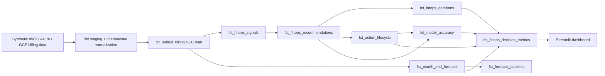

# Multi-Cloud FinOps Decision Engine

> **An explainable multi-cloud FinOps decision engine for attribution, waste detection, forecasting, and risk-aware optimization across AWS, Azure, and GCP.**

**Authors:** Keerthi Rapolu and Rishika Naha  
**Date:** April 2026  
**Status:** Research prototype with synthetic but reproducible benchmark data

---

## Abstract

This repository implements an explainable, post-billing FinOps decision system that normalizes AWS, Azure, and GCP billing data into a canonical Net Effective Cost (NEC) model, quantifies attribution gaps, identifies recoverable inefficiencies, ranks recommendations with explicit reasoning, and projects month-end cost under baseline and optimized scenarios. The system is designed as a reproducible research demo rather than an autonomous remediation platform: all metrics are derived from canonical DuckDB/dbt models, all recommendation scores are deterministic, and all savings layers are separated into raw signal, recoverable opportunity, actionable savings, and realization-adjusted projected savings.

## Problem

Multi-cloud cost management remains fragmented because each provider exposes different billing schemas, discount semantics, and attribution fields. Traditional dashboards can show where spend occurred, but they usually do not answer the harder operational questions:

- what portion of NEC is unattributed and therefore not optimization-ready
- what inefficiency signals are technically recoverable
- what savings remain actionable after risk and feasibility rules
- what month-end NEC is likely under current behavior versus likely under successful remediation
- what evidence supports each recommendation

## Research Gap

Most FinOps tools stop at descriptive reporting. They do not combine all of the following in one open, reproducible system:

- canonical NEC-based normalization across AWS, Azure, and GCP
- attribution governance and owner-assignment diagnostics
- explicit waste-signal taxonomy
- deterministic recommendation scoring with auditability
- realization-adjusted savings projection
- scenario-aware month-end forecasting
- recommendation lifecycle and validation hooks

## Proposed System

The repository positions Streamlit as a presentation layer over a canonical decision layer. Business logic is computed once in dbt/Python and then rendered across pages without page-specific formulas.

Canonical outputs:

- `marts.fct_finops_summary`
- `marts.fct_finops_signals`
- `marts.fct_finops_recommendations`
- `marts.fct_finops_decisions`
- `marts.fct_action_lifecycle`
- `marts.fct_month_end_forecast`
- `marts.fct_forecast_backtest`
- `marts.fct_model_accuracy`
- `marts.fct_finops_decision_metrics`

Recommendation confidence is also calibrated in the Python and dbt layers using:

- signal persistence across periods
- corroborating signals in the same scope
- a penalty for anomaly-only evidence without corroboration

## Architecture

1. Ingest synthetic AWS CUR, Azure Cost Export, and GCP Billing Export data.
2. Normalize cloud-specific billing semantics in dbt staging and intermediate models.
3. Materialize a unified NEC mart in DuckDB.
4. Compute canonical FinOps signals, recommendations, decisions, lifecycle rows, and forecasts.
5. Render the canonical outputs in Streamlit without recomputing business logic per page.



## What Is Novel Here?

This repository is not just a cloud-cost dashboard. The research contribution is the combination of:

- a canonical FinOps decision model that separates raw waste signal, recoverable savings, actionable savings, and realization-adjusted projected savings
- explainable signal-to-action mapping with deterministic root-cause reasoning and auditable evidence
- confidence-calibrated recommendations that account for persistence, corroboration, and anomaly-only penalties
- lightweight forecast backtesting through `fct_forecast_backtest` rather than unvalidated projection-only output
- lifecycle and realized-savings readiness through `fct_action_lifecycle` and `fct_model_accuracy`
- a reproducible synthetic benchmark that can be rebuilt locally with dbt, DuckDB, and tests

## Canonical Definitions

The system uses these definitions consistently across code, marts, and dashboard pages:

- `list_cost`: pre-discount cloud cost
- `nec`: net effective cost after cloud pricing effects
- `unattributed_nec`: NEC without accountable owner or team attribution
- `waste_signal`: raw detected inefficiency magnitude before recovery or execution filters
- `recoverable_savings`: technically recoverable amount before execution and realization constraints
- `actionable_savings`: risk-screened savings allowed after feasibility rules
- `projected_savings`: realization-adjusted expected savings
- `optimized_nec`: projected month-end NEC minus projected savings
- `commitment_waste`: unused RI, SP, or commitment capacity
- `tagging_gap`: unattributed NEC divided by NEC
- `waste_rate`: commitment waste divided by NEC

## Evaluation Methodology

The repository reports evaluation-oriented metrics rather than unsupported production claims:

- attribution coverage %
- unattributed NEC %
- commitment waste %
- recoverable savings
- actionable savings
- projected savings
- recommendation counts and actionability rate
- confidence-weighted / quality-adjusted projected savings
- SLA breach counts
- forecast confidence and bounded projection ranges
- forecast backtest error metrics via `fct_forecast_backtest`
- action lifecycle accuracy via `fct_action_lifecycle` and `fct_model_accuracy`

## Reproducibility

- Synthetic billing data for multiple months is committed to the repository.
- dbt models produce all canonical marts in DuckDB.
- Python reasoning and forecast layers are deterministic.
- Tests validate numeric consistency, scoring determinism, and cross-mart invariants.
- Forecast outputs can be backtested against historical synthetic months.
- The forecast quality score shown in the dashboard is a heuristic composite support score, not probabilistic confidence.
- The displayed historical-variance band is derived from recent variance in prior months, not a predictive-model confidence interval.
- Lifecycle rows can be persisted locally and re-materialized into canonical marts.

## Limitations

- The dataset is synthetic and should be treated as a reproducible benchmark, not enterprise validation.
- The system does not perform autonomous remediation; it produces explainable recommendations and tracked lifecycle state.
- `idle_compute_proxy` is billing-derived and does not yet use runtime CPU or memory telemetry; telemetry-backed idle detection is phase 2 work.
- Real-world validation is still pending; current evaluation is against a reproducible synthetic benchmark only.
- Lifecycle and realized-savings tracking are implemented as canonical data structures, but real enterprise action history is not yet available in this repo.

## Boundary With Intent-Aware Cloud Governance

This repository focuses on post-billing FinOps accountability and decision support only:

- multi-cloud billing normalization
- NEC modeling
- allocation and chargeback
- tagging governance
- waste detection
- recommendation scoring
- month-end forecast
- action lifecycle validation

It does **not** implement intent-aware provisioning, semantic workload governance, runtime optimization, vector search, or LLM-based policy reasoning. Those belong to the separate `intent-aware-cloud-governance` repository.

## Final Audit Checks

The repository has been audited for the following publication-readiness constraints:

- no raw emoji markdown such as `:green_circle:` or `:mag:` in the dashboard code paths
- no dashboard KPI pages intentionally hardcode canonical FinOps totals
- README claims match implemented canonical marts, scoring, forecast, and lifecycle behavior
- documentation does not claim production validation, autonomous remediation, or real enterprise savings

## Quick Start

```bash
# Clone and install
git clone https://github.com/Keerthi-Rapolu/multicloud-finops-framework.git
cd multicloud-finops-framework
pip install -r requirements.txt

# Build data + marts + tests + dashboard
make demo
```

```bash
# Or run stages individually
make data
make dbt
make test
make dashboard
```

---
## Core Concepts

### Net Effective Cost (NEC)

`unblended_cost` is the wrong metric for RI/SP chargeback. It systematically misrepresents cost for commitment-covered resources:

- **RI-covered hours** → `unblended_cost = $0.00` — the instance appears free, making teams with RI coverage look artificially efficient
- **SP-covered hours** → `unblended_cost = on-demand rate` — the discount is invisible, overstating team cost

NEC corrects this per cloud by reading from the commitment-specific cost fields that reflect actual amortized spend:

| Cloud | Line Item Type | NEC Formula |
|---|---|---|
| **AWS** `DiscountedUsage` | RI-covered compute | `nec = reservation/EffectiveCost` |
| **AWS** `SavingsPlanCoveredUsage` | SP-covered compute | `nec = savingsPlan/SavingsPlanEffectiveCost` |
| **AWS** `RIFee` | Monthly RI commitment row | `nec_used = 0`; `nec_waste = unused_upfront + unused_recurring` |
| **AWS** `SavingsPlanRecurringFee` | Monthly SP commitment row | `nec_waste = recurring_commitment − used_commitment` |
| **Azure** `Usage` | Amortized export row | `nec = CostInBillingCurrency` (RI/SP spread daily across covered resources) |
| **Azure** `UnusedReservation / UnusedSavingsPlan` | Idle commitment row | `nec_waste = CostInBillingCurrency` |
| **GCP** Detailed Export | All service rows | `nec = GREATEST(cost + Σ credit.amount, 0)` |

The `nec_used` / `nec_waste` split is preserved through the Gold layer, enabling both accurate chargeback and waste attribution at team granularity.

### Shared Cost Distribution

Shared infrastructure (VPC networking, CloudTrail, Security Hub, centralized monitoring) has no direct resource owner and must be distributed across teams. Three configurable strategies are supported, set per-service in [`config/shared_cost_weights.yml`](config/shared_cost_weights.yml):

| Strategy | Formula | When to use |
|---|---|---|
| `proportional` | `share = team_direct_nec / Σ all_direct_nec` | Default — allocation tracks actual usage weight |
| `even` | `share = 1 / N` | Small teams where usage-proportional splits create noise |
| `weighted` | `share = team_weight / Σ weights` | Headcount or contractual SLA differences; weights defined in config |

Default business-unit weights: Platform 30%, Data Engineering 25%, Frontend 20%, Backend 15%, ML 10%.

### Unified Cost Allocation Schema (CAS)

All three clouds normalize to a single 31-column schema in `fct_unified_billing`. Every row, regardless of origin, exposes the same fields for downstream analysis:

```
Identity      cloud_provider · billing_account_id · billing_month · account_id · account_name
Time          usage_date
Resource      resource_id · service_name · product_name · instance_type · region
Usage         usage_amount · usage_unit · currency
Cost          list_cost · nec · nec_used · nec_waste · effective_unit_price · discount_type
Compute       vcpu · memory_gb
Tags          tag_team · tag_environment · tag_cost_center · is_tagged
Allocation    allocated_team · allocated_nec · is_shared_cost · is_commitment_waste
Category      service_category  (Compute | Storage | Database | Analytics | Platform | Other)
```

The `is_commitment_waste` and `is_shared_cost` boolean flags allow downstream consumers to slice waste, shared cost, and attributed spend without any additional joins.

### Cost Intelligence Layer

The intelligence layer sits downstream of the allocation engine and transforms billing data from descriptive reporting into prescriptive analysis. It comprises four engines that operate in a sequential pipeline:

#### 1. Waste Detection Engine

Classifies every resource across four waste categories using configurable thresholds from [`config/waste_thresholds.yml`](config/waste_thresholds.yml):

| Waste Type | Detection Logic | Typical Cause |
|---|---|---|
| `unused_commitment` | `is_commitment_waste = true` with `nec_waste > threshold` | RI or SP purchased beyond actual usage |
| `idle_compute` | Compute rows with `nec_used / vcpu` below idle floor | Over-provisioned EC2 / VM left running without load |
| `zombie_resource` | `0 < nec_used < monthly_floor` for the full billing period | Forgotten resource — decommissioned but not deleted |
| `underutilized_commitment` | RI/SP rows where `used / total_commitment < utilization_threshold` | Commitment purchased for a workload that was later downsized |

Each `WasteFinding` carries an `estimated_waste` dollar amount, a `confidence` score (0–1), and the `allocated_team` owner from the attribution layer — making waste directly actionable at the team level.

#### 2. Causal Reasoning Engine

Explains *why* a team's cost looks the way it does by deriving structured facts from billing patterns and assembling them into ranked root cause chains. For each team it produces a `CausalInsight` containing:

- **Root causes** — ordered list of `RootCause` objects, each with a `fact_type`, human-readable description, and `confidence` score
- **MoM trend signal** — direction and magnitude of month-over-month NEC change (requires ≥ 2 months of data)
- **Anomaly flag** — z-score deviation from the rolling billing baseline; a score ≥ 2.0 triggers an anomaly explanation

Fact types the engine reasons over: `commitment_waste_identified`, `idle_resources_detected`, `untagged_cost_gap`, `service_category_dominance`, `team_cost_spike`, `team_cost_decrease`. When only one billing month is available the engine produces fact-only insights; loading multiple months (December 2025 – April 2026 synthetic data ships in the repo) activates full trend and anomaly reasoning.

#### 3. Impact Simulation Engine

Converts `WasteFinding` objects into prioritised `Recommendation` dicts by estimating recoverable savings using conservative, evidence-backed recovery rates:

| Action | Recovery Rate | Risk Level |
|---|---|---|
| `release_commitment` (unused) | 100% of `nec_waste` | Low |
| `resize_down` (idle compute) | 60% of waste signal | Low |
| `remove_resource` (zombie) | 90% of `nec_used` | Medium |
| `release_commitment` (underutilized) | 50% of waste signal | Medium |

Recommendations are ranked by the canonical FinOps scoring formula:

`priority_score = 0.35 * normalized_savings + 0.25 * confidence + 0.20 * governance_severity + 0.10 * urgency + 0.10 * low_risk_bonus`

Where:
- `normalized_savings = recommendation_savings / max_savings_in_scope`
- `governance_severity = 1.0` for severe attribution gaps, `0.8` for shared-cost concentration, `0.65` for anomaly or forecast risk, `0.35` for commitment waste, and `0.30` for idle or zombie resource signals, with `+0.10` for missing ownership and `+0.10` for SLA breach
- `urgency = 0.60 * normalized_waste_growth_rate + 0.40 * normalized_anomaly_score`
- `low_risk_bonus` is highest for no-downtime, no-approval actions

Recommendations are deduplicated at the canonical signal/action level for the current billing scope, and the Waste page renders only recoverable optimization actions. Governance gaps and forecast risks remain in Insights so unattributed cost is not mislabeled as direct waste.

#### 4. Explainable Decision Support Layer

On top of raw findings and recommendations, the dashboard exposes three decision-support capabilities:

- **Reasoning engine** — turns normalized FinOps signals into structured decisions with `root_cause`, `evidence`, `recommended_action`, `action_justification`, `confidence_score`, `risk_score`, `approval_required`, and `next_best_action`
- **Lightweight forecasting** — projects month-end NEC, commitment waste, unattributed NEC, and action-adjusted savings using explainable methods such as month-to-date run rate and trailing moving averages
- **Action lifecycle tracking** — keeps local/demo recommendation state (`recommended → approved/rejected → implemented → verified`) with owner, expected savings, realized savings, and verification notes

This is what makes the project a publishable decision engine rather than only a reporting surface.

---

## Synthetic Data Scenarios

The pipeline ships with named test scenarios — no real billing credentials needed:

| Scenario | Untagged | RI Coverage | SP Coverage | Hours sampled |
|---|---|---|---|---|
| `normal` | 15% | 20% | 15% | 72 |
| `untagged-medium` | 35% | 20% | 15% | 72 |
| `untagged-heavy` | 55% | 20% | 15% | 72 |
| `ri-heavy` | 15% | 60% | 10% | 72 |
| `sp-heavy` | 15% | 10% | 60% | 72 |
| `full-month` | 15% | 20% | 15% | 720 (full) |

```bash
make pipeline SCENARIO=untagged-heavy MONTH=2026-04
```

---

## Project Structure

```
multicloud-finops-framework/
│
├── load_synthetic.py           # Pipeline entry point: generate → validate → land
├── Makefile                    # make demo / make pipeline / make test
├── requirements.txt
├── mkdocs.yml
│
├── scripts/                    # Synthetic data generators
│   ├── config.py               # GeneratorConfig + named SCENARIOS
│   ├── generate_aws_cur.py
│   ├── generate_azure_cost.py
│   └── generate_gcp_billing.py
│
├── ingestion/                  # Validators + Parquet writers per cloud
│   ├── aws_ingestor.py
│   ├── azure_ingestor.py
│   ├── gcp_ingestor.py
│   └── schemas/                # Schema version definitions
│
├── dbt_project/                # dbt Core project (DuckDB adapter)
│   └── models/
│       ├── staging/            # Bronze: rename, cast, extract tags
│       ├── intermediate/       # Silver: NEC / RI / SP / CUD amortization
│       └── marts/              # Gold: fct_unified_billing (UNION ALL → CAS)
│
├── allocation/                 # Python allocation engine
│   ├── nec_model.py            # NEC aggregations from DuckDB mart
│   ├── shared_cost.py          # Shared cost distribution (3 strategies)
│   ├── tag_allocator.py        # Tag-based direct allocation
│   ├── untagged_heuristic.py   # Rule-based attribution for untagged rows
│   └── untagged_ml.py          # Optional RandomForest classifier
│
├── config/
│   ├── shared_cost_weights.yml # per-service strategy + team weights
│   ├── heuristic_rules.yml     # pattern → team rules for untagged attribution
│   └── waste_thresholds.yml    # idle / utilization thresholds per service type
│
├── intelligence/               # Phase 2 cost intelligence layer
│   ├── __init__.py
│   ├── waste_detector.py       # idle / zombie / underutilized resource detection
│   ├── causal_engine.py        # root cause reasoning over billing cost trends
│   └── impact_simulator.py     # estimate savings + risk for optimization actions
│
├── dashboard/                  # Streamlit dashboard
│   ├── app.py
│   ├── _shared.py              # shared UI helpers, color constants, diagnose()
│   └── pages/
│       ├── 01_overview.py
│       ├── 02_allocation.py    # Cost Allocation (team NEC + commitments + shared costs)
│       ├── 03_tagging.py       # Tagging & Attribution (coverage + SLA tracker)
│       ├── 04_waste_recommendations.py  # Waste & Recommendations (5-step pipeline)
│       └── 05_insights.py      # Cost Intelligence (causal engine + decision cards)
│
├── tests/
│   ├── test_nec_model.py       # NEC aggregation, waste, utilization
│   ├── test_shared_cost.py     # proportional / even / weighted strategies
│   ├── test_normalization.py   # ingestion schema validation per cloud
│   ├── test_untagged.py        # heuristic rule engine + coverage metrics
│   ├── test_waste_detector.py  # waste detection across all four waste types
│   ├── test_causal_engine.py   # causal fact building + root cause reasoning
│   └── test_impact_simulator.py  # savings estimation + risk scoring
│
├── docs/                       # MkDocs source → GitHub Pages
│   ├── index.md
│   ├── STAGING.md
│   ├── NEC_CALCULATIONS.md
│   ├── AWS_CUR_REFERENCE.md
│   ├── AZURE_COST_REFERENCE.md
│   └── GCP_BILLING_REFERENCE.md
│
└── .github/workflows/
    ├── ci.yml                  # Tests on push to main / dev
    └── pipeline.yml            # Weekly synthetic pipeline run
```

---

## Technology Stack

| Layer | Tool | Why |
|---|---|---|
| Data transform | **dbt Core + DuckDB** | SQL-first, version-controlled, runs entirely in-process — no infrastructure |
| Processing | **Python 3.11 + pandas + PyArrow** | Parquet I/O, schema validation, allocation engine |
| Intelligence | **Python + PyYAML + NumPy** | Deterministic waste detection, causal reasoning, and impact simulation — no LLM required |
| Dashboard | **Streamlit + Plotly** | Python-native, free tier deploy on Streamlit Cloud |
| Orchestration | **GitHub Actions** | Free 2,000 min/month — CI + weekly pipeline |
| ML (optional) | **scikit-learn** | `RandomForestClassifier` for untagged resource attribution |
| Docs | **MkDocs + GitHub Pages** | Versioned with code, free deploy |

Everything is free. No cloud compute, no paid APIs, no proprietary SaaS.

---

## Documentation

| Doc | What it covers |
|---|---|
| [docs/STAGING.md](docs/STAGING.md) | Every column in `stg_aws_cur`, `stg_azure_cost`, `stg_gcp_billing` — what it means, filters applied, shared conventions |
| [docs/NEC_CALCULATIONS.md](docs/NEC_CALCULATIONS.md) | NEC formulas per cloud with worked dollar examples |
| [docs/AWS_CUR_REFERENCE.md](docs/AWS_CUR_REFERENCE.md) | Full AWS CUR column reference, RI/SP cost flow, which column to use for chargeback vs waste |
| [docs/AZURE_COST_REFERENCE.md](docs/AZURE_COST_REFERENCE.md) | Azure amortized vs actual export, RI/SP daily row mechanics, shared-cost spreading |
| [docs/GCP_BILLING_REFERENCE.md](docs/GCP_BILLING_REFERENCE.md) | GCP credits JSON structure, CUD/SUD mechanics, label format, `is_unused_reservation` |
| [DESIGN_DOCUMENT.md](DESIGN_DOCUMENT.md) | Full architecture, CAS schema decisions, module design, work division |

---

## Querying Results Directly

After `make dbt`, the mart is in `finops_dbt.duckdb`:

```python
import duckdb

con = duckdb.connect("finops_dbt.duckdb", read_only=True)

# Spend by cloud and service category
con.execute("""
    SELECT cloud_provider, service_category,
           COUNT(*) AS rows,
           ROUND(SUM(nec), 2) AS total_nec
    FROM main_marts.fct_unified_billing
    GROUP BY 1, 2 ORDER BY 1, 3 DESC
""").df()

# Commitment waste by cloud
con.execute("""
    SELECT cloud_provider,
           ROUND(SUM(CASE WHEN is_commitment_waste THEN nec_waste ELSE 0 END), 2) AS waste,
           ROUND(SUM(nec_used), 2) AS used
    FROM main_marts.fct_unified_billing
    GROUP BY cloud_provider
""").df()
```

Alternatively, connect via **SQLTools + DuckDB Sql Tools** in VS Code — point it at `finops_dbt.duckdb` for a full schema browser and ad-hoc SQL.

---

## Sample Output

**Spend by cloud and service category** (`fct_unified_billing`):

| cloud_provider | service_category | rows  | total_nec  |
|----------------|-----------------|------:|-----------:|
| aws            | Compute         | 8,412 | $18,243.60 |
| aws            | Storage         | 3,201 | $2,104.80  |
| aws            | Database        | 1,890 | $4,310.20  |
| azure          | Compute         | 6,038 | $14,092.40 |
| azure          | Storage         | 2,540 | $1,876.30  |
| gcp            | Compute         | 5,114 | $11,405.90 |
| gcp            | Analytics       | 2,203 | $3,211.70  |

**NEC vs list cost — savings from commitments**:

| cloud_provider | discount_type | list_cost   | nec         | savings    |
|----------------|--------------|------------:|------------:|-----------:|
| aws            | ri           | $12,400.00  | $8,680.00   | $3,720.00  |
| aws            | sp           | $6,200.00   | $4,712.00   | $1,488.00  |
| aws            | on_demand    | $8,100.00   | $8,100.00   | $0.00      |
| azure          | ri           | $9,800.00   | $7,056.00   | $2,744.00  |
| gcp            | on_demand    | $11,405.90  | $9,635.90   | $1,770.00  |

**Per-team allocated NEC** (proportional shared-cost distribution):

| allocated_team | cloud_provider | allocated_nec | is_shared_cost |
|----------------|---------------|-------------:|----------------|
| platform       | aws           | $9,140.30    | false          |
| data-eng       | aws           | $6,820.10    | false          |
| platform       | azure         | $5,210.40    | true           |
| frontend       | gcp           | $3,880.20    | false          |

> These figures are from the `normal` synthetic scenario (15% untagged, 20% RI, 15% SP). Run `make pipeline` to reproduce them locally.

---

## Dashboard

The Streamlit dashboard has a home page plus 5 detail pages — run with `make dashboard` after `make dbt`:

| Surface | What it shows |
|---|---|
| **Home (executive summary)** | Portfolio KPIs; spend-by-cloud stacked bar; traffic-light health signals for commitment waste %, tagging gap %, and top cost centre; navigation guidance |
| **Overview** | 5 KPI tiles (list cost, NEC, savings vs list cost, waste, waste %); daily NEC trend with z-score anomaly markers and explanation; savings by pricing model (on_demand / RI / SP); top commitment waste contributors; cloud summary table; 3 insight callouts with actionable recommendations |
| **Cost Allocation** | Per-team NEC breakdown; commitment utilization (RI/SP) with 100% target line; shared cost distribution by strategy (proportional / even / weighted — Platform 30%, Data Engineering 25%, Frontend 20%, Backend 15%, ML 10%); idle commitment waste detail table |
| **Tagging & Attribution** | Coverage analytics by cloud / service / account; ownership assignment; SLA-based escalation tracker (7-day fix-it SLA); tag quality scoring; enforcement alerts when untagged NEC ≥ 10% |
| **Waste & Recommendations** | 5-step waste-to-action pipeline: (1) waste breakdown by type and team, (2) cross-cloud inefficiency charts (absolute and relative), (3) prioritised action list with savings estimates, (4) quick wins (low risk, act now), (5) projected before/after impact and scenario comparison |
| **Cost Intelligence** | Explainable decision engine: top 3 weekly ROI actions; team decision cards with root cause analysis, evidence, confidence, risk, and next-best action; cost trend by team; anomaly explanations with causal attribution; forecast outlook |

> All data is synthetic — cloud distribution does not reflect real-world proportions.

> GitHub README does not support embedded interactive content. To try the live dashboard, run `make demo` locally or deploy the `dashboard/` folder to [Streamlit Community Cloud](https://streamlit.io/cloud) for free.

### Example Action Workflow

The dashboard is designed to support one clear FinOps workflow end to end:

1. **Find the problem** — the Home page and Insights page surface the dominant issue: unattributed NEC, commitment waste, or abnormal cost movement.
2. **Understand why it happened** — Waste & Recommendations and Cost Intelligence show evidence, confidence, risk, and the likely operational cause.
3. **Assign ownership** — Tagging & Attribution identifies gaps and allows owner assignment where direct attribution is missing.
4. **Choose a safe action** — recommendations carry `risk_score`, `risk_reason`, `approval_required`, and `action_safety`.
5. **Track the outcome** — the recommendation lifecycle records `recommended -> approved/rejected -> implemented -> verified`, with expected and realized savings for demo tracking.

### Demo Story

For a short walkthrough, use this sequence:

1. Open **Home** to show portfolio NEC, commitment waste, unattributed NEC, and the maturity score.
2. Open **Cost Intelligence** to show the top 3 actions for the week plus the month-end forecast.
3. Open **Waste & Recommendations** to show the action table, approval posture, and lifecycle state.
4. Open **Tagging & Attribution** to show ownership gaps and how unattributed NEC can be reduced.
5. Return to **Cost Intelligence** and export the executive markdown summary or Jira-ready action list.

### Suggested Screenshots

If you are preparing a demo or submission, these are the most useful screenshots to capture:

- Home page executive summary and maturity score
- Cost Intelligence forecast outlook and weekly action panel
- Waste & Recommendations prioritised action list with lifecycle state
- Tagging & Attribution owner assignment / SLA view
- Before-vs-after impact section showing projected savings

---

## Scope and Limitations

This version is a **local, synthetic-data reference implementation**. It is designed to demonstrate the framework architecture and allocation methodology, not to be plugged directly into a production billing pipeline.

| Limitation | Detail |
|---|---|
| **Synthetic data only** | All billing data is generated — no real AWS/Azure/GCP credentials required or used |
| **Local execution** | Pipeline runs on DuckDB in-process; production scale-out requires replacing DuckDB with Apache Spark |
| **Batch only** | No real-time streaming — ingestion is triggered manually or on a weekly GitHub Actions schedule |
| **No live utilization telemetry** | Real observability feeds and deployment/change events are not yet wired into the recommendation logic |
| **GCP waste detection** | Relies on `is_unused_reservation` system label, which is only available in the Detailed Usage Export (not Standard Export) |
| **ML classifier** | Requires sufficient tagged rows as training data; degrades at very low tagging coverage (< 20%) |
| **No auth / secrets handling** | Production deployments would need cloud credential management (IAM roles, Workload Identity, etc.) |
| **Azure shared-cost spreading** | Currently done in the dbt intermediate layer; AWS and GCP pass through `tag_team` as-is |

**Future work:** utilization telemetry from CloudWatch / Azure Monitor / GCP Monitoring, deployment/change correlation, unit economics, realized savings validation, production persistence for approval workflows, and ticketing integrations such as Jira or ServiceNow.

---

## Research Paper

This framework accompanies a research paper submitted to arXiv / IEEE CLOUD:

> **A Multi-Cloud Cost Intelligence Framework: Attribution, Waste Detection, Causal Reasoning, and Impact Simulation**
> Keerthi Rapolu, Rishika Naha — 2026

Key contributions documented in the paper:

**Phase 1 — Cost Allocation Framework**
- A 31-column Unified Cost Allocation Schema (CAS) with complete field mappings for AWS CUR, Azure Cost Management Export, and GCP Billing Detailed Export
- Per-cloud Net Effective Cost (NEC) amortization formulas covering RI, Savings Plans, and CUDs — with validation against AWS Cost Explorer reference values
- Three configurable shared-cost distribution strategies (proportional, even, weighted) with empirical comparison on synthetic data
- A two-stage untagged resource attribution engine: deterministic heuristic rules backed by an optional `RandomForestClassifier` for higher-coverage environments

**Phase 2 — Cost Intelligence Layer**
- A taxonomy-driven waste detection engine that classifies billing-side inefficiencies into four categories (`unused_commitment`, `idle_compute`, `zombie_resource`, `underutilized_commitment`) with per-finding confidence scores and team ownership attribution
- A causal reasoning engine that derives structured facts from billing patterns and constructs ranked root-cause chains per team, with MoM trend analysis and statistical anomaly detection (z-score ≥ 2.0)
- An impact simulation engine that converts waste findings into prioritised recommendations using conservative, evidence-backed recovery rates and a risk-adjusted priority scoring model

---

## CI

On every push to `main` or `dev`, GitHub Actions runs:
1. `pytest tests/ -v` — full test suite covering NEC model, shared cost, normalization, untagged attribution, waste detection, causal reasoning, and impact simulation
2. `python load_synthetic.py --month 2026-03 --force` — smoke test: generate and validate all three cloud schemas
3. `dbt run` — materialize all Bronze / Silver / Gold models
4. `dbt test` — run dbt schema tests against the mart

---

## License

MIT
