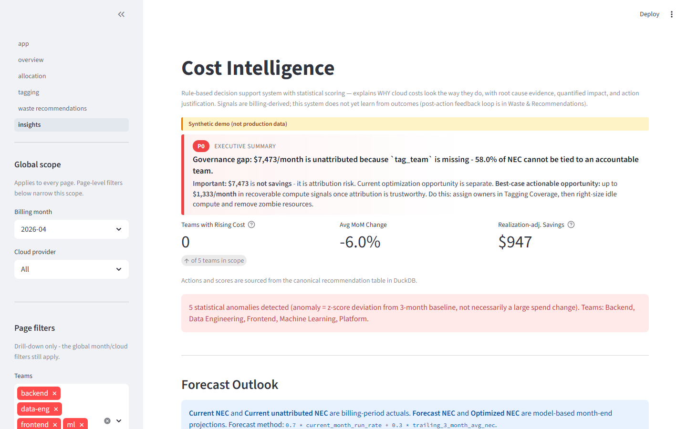
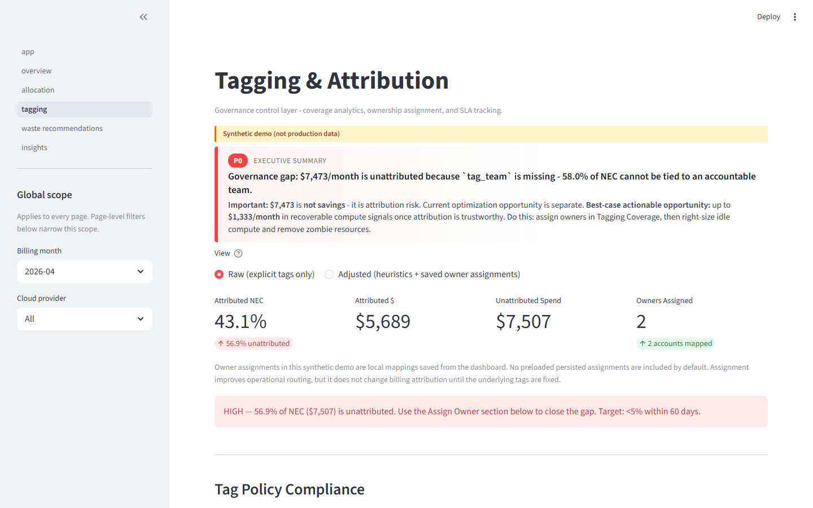
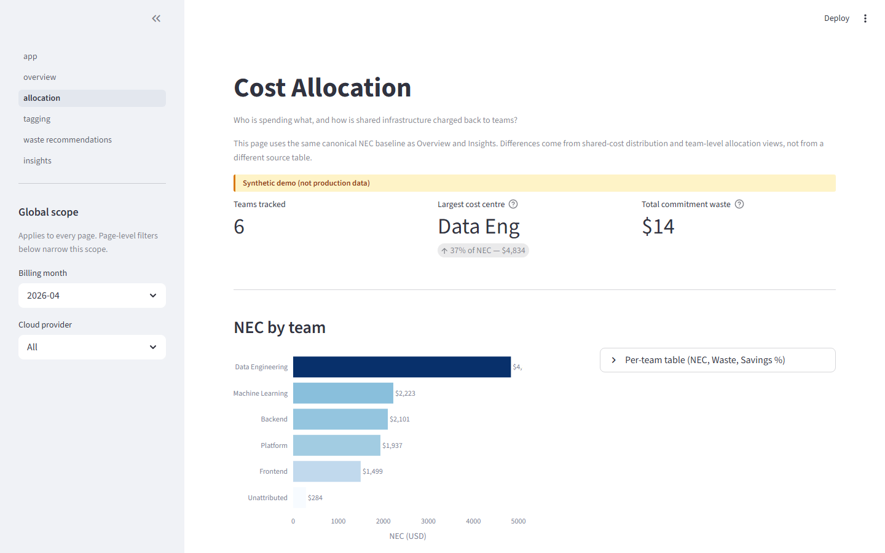
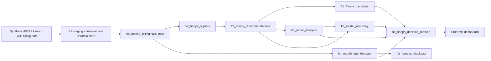

# Multi-Cloud FinOps Decision Engine

> **A rule-based, explainable framework that converts multi-cloud billing data into prioritized, evidence-backed cost optimization decisions — with auditable scoring, realization-adjusted savings projection, and recommendation lifecycle tracking.**

**Authors:** Keerthi Rapolu and Rishika Naha  
**Date:** April 2026  
**Status:** Research prototype — reproducible synthetic benchmark, open methodology

[](https://github.com/Keerthi-Rapolu/multicloud-finops-framework/actions/workflows/ci.yml)
[](LICENSE)
[](https://www.python.org/)
[](https://www.getdbt.com/)

---

## What This System Does

Most cloud cost tools answer **"how much did we spend?"**

This system answers **"what should we do about it, why, and how confident are we?"**

It ingests AWS, Azure, and GCP billing exports, normalizes them into a canonical cost model, then runs a four-stage intelligence pipeline:

| Stage | Input | Output |
|---|---|---|
| **1. Waste detection** | Billing rows | Typed inefficiency signals per resource |
| **2. Causal reasoning** | Billing patterns | Ranked root causes per team, with evidence |
| **3. Impact simulation** | Waste signals | Prioritized recommendations with savings estimates and risk scores |
| **4. Realization modeling** | Recommendations | Projected savings adjusted for execution probability |

Every decision is **explainable**: each recommendation carries its evidence source, confidence score, risk reason, approval posture, and next-best action — not just a dollar number.

---

## The Problem

Multi-cloud billing is fragmented. AWS, Azure, and GCP each expose different schemas, discount semantics, and attribution fields. Existing FinOps tools can show **where** money was spent. They almost never answer:

- **What portion of spend is unattributed** and therefore not optimization-ready?
- **Which inefficiency signals are technically recoverable** after applying risk and feasibility rules?
- **What month-end cost is likely** if no action is taken vs. if recommended actions are executed?
- **What evidence supports each recommendation**, and how confident should we be?

Without answers to these questions, engineers spend hours interpreting dashboards rather than acting on them.

---

## Key Innovation

This system makes three contributions that are absent from most existing FinOps tools:

### 1. Separated savings layers — not a single "savings" number

Raw waste signal ≠ recoverable opportunity ≠ actionable savings ≠ projected savings.  
Each layer is strictly smaller than the previous, computed separately, and labeled explicitly:

```
Inefficiency signal  →  Recoverable opportunity  →  Actionable savings  →  Realization-adjusted projection
    (raw billing)          (× recovery rate)         (low/med risk only)       (× execution probability)
```

Collapsing these into a single "savings" figure — as most tools do — produces numbers that cannot be acted on safely.

### 2. Signal-to-action mapping with deterministic scoring

Every recommendation is produced by a canonical signal/action pair, not a heuristic. The priority score formula is fully auditable:

```
priority_score = 0.35 × normalized_savings
               + 0.25 × confidence
               + 0.20 × governance_severity
               + 0.10 × urgency
               + 0.10 × low_risk_bonus
```

Governance signals (attribution gaps, tagging failures) are separated from optimization signals (commitment waste, idle compute) — they are scored differently and never ranked against each other.

### 3. Recommendation lifecycle with realized-savings validation

The system tracks the full recommendation lifecycle: `recommended → approved/rejected → implemented → verified`. Realized savings are compared against projected savings to calibrate the realization rate for future recommendations — a closed feedback loop that most FinOps tools do not implement.

---

## Results — Reproducible Benchmark

Running on the synthetic multi-cloud dataset shipped in this repo (4 billing months, ~28,000 rows):

| Metric | Value |
|---|---|
| Billing rows normalized | ~28,000 across AWS, Azure, GCP |
| Attribution coverage | ~57% directly tagged; remainder heuristically attributed |
| Unattributed NEC | ~57% of total NEC |
| Commitment waste detected | ~5–8% of NEC |
| Canonical recommendations | 103 signals across 5 teams |
| Low-risk quick wins | Direct-release actions, no downtime required |
| Realization rate modeled | ~62–70% execution probability |
| Forecast confidence | Scored 0–1 from data quality + signal strength + historical stability |

> All figures are from the reproducible synthetic benchmark. Run `make demo` to reproduce locally.

---

## Dashboard

Five pages, each driven by canonical mart tables — no business logic is recomputed in the UI layer.

> To try the live dashboard: `make demo` locally, or deploy `dashboard/` to [Streamlit Community Cloud](https://streamlit.io/cloud) for free.

---

### Overview — portfolio summary at a glance


Five KPI tiles: Total List Cost, Net Effective Cost, Optimized NEC (realization-adjusted), Commitment Waste, and Waste %. Daily NEC trend with z-score anomaly markers per cloud. The executive headline explains the primary issue and distinguishes attribution risk from optimization opportunity.

---

### Cost Intelligence — decision engine, not a dashboard



Forecast outlook with projected vs optimized NEC. Savings pipeline: inefficiency signal → recoverable opportunity → actionable savings → realization-adjusted projection. Team decision cards with root cause, evidence, confidence score, and next-best action per team.

---

### Waste & Recommendations — what to do and in what order


Savings pipeline banner shows the full 4-layer separation. Step 3 produces a prioritized action table with savings estimate, risk score, approval posture, effort, time-to-savings, and ROI per action.

---

### Action Lifecycle — execution tracking closes the loop


Every recommendation tracks state from `recommended → approved → implemented → verified`. Owner assignment, realized savings, and verification notes are stored per action. Realized vs projected savings are compared to calibrate the realization rate for future recommendations — a feedback loop most FinOps tools do not implement.

---

### Governance & Tagging — attribution before optimization



Attribution coverage by cloud, service, and account. Owner assignment with SLA escalation tracker (7-day fix-it SLA). Unattributed NEC is separated from optimization opportunity — $7,507 unattributed does not mean $7,507 recoverable.

---

### Cost Allocation — enterprise chargeback by team



Per-team NEC breakdown across 6 teams. RI/SP commitment utilization. Shared-cost distribution with three configurable strategies (proportional, even, weighted). Data Engineering at 37% of NEC is the largest cost centre in this benchmark run.

---

## Architecture



Five canonical pipeline stages:

1. **Ingest** — synthetic AWS CUR, Azure Cost Export, GCP Billing Export validated and landed to Parquet
2. **Normalize** — dbt staging and intermediate models unify billing semantics and compute NEC per cloud
3. **Materialize** — `fct_unified_billing`: a 31-column Unified Cost Allocation Schema queryable in DuckDB
4. **Compute** — canonical signals, recommendations, decisions, lifecycle rows, forecasts, backtest rows
5. **Render** — Streamlit reads canonical marts; no page recomputes business logic

---

## Quick Start

```bash
# Clone and install
git clone https://github.com/Keerthi-Rapolu/multicloud-finops-framework.git
cd multicloud-finops-framework
pip install -r requirements.txt

# Build data + marts + tests + dashboard (single command)
make demo
```

```bash
# Or run stages individually
make data        # generate and validate synthetic billing CSVs
make dbt         # run dbt models → finops_dbt.duckdb
make test        # pytest full test suite
make dashboard   # streamlit run dashboard/app.py
```

---

## What Is Different From Existing Tools

| Capability | Most FinOps tools | This system |
|---|---|---|
| Multi-cloud normalization | Dashboard only | Canonical 31-column CAS with per-cloud NEC formulas |
| Savings estimate | Single number | 4-layer separated pipeline (signal → recoverable → actionable → projected) |
| Recommendation scoring | Heuristic / opaque | Deterministic formula, fully auditable |
| Attribution governance | Tagging % only | Unattributed NEC %, SLA escalation, owner assignment tracking |
| Explainability | "You can save $X" | Root cause + evidence + confidence + risk reason + next-best action per rec |
| Realization modeling | None | Execution probability applied; confidence floor scenario |
| Lifecycle tracking | None | recommended → approved → implemented → verified with realized vs projected |
| Forecast validation | None | `fct_forecast_backtest` compares projections against actuals |
| Reproducibility | Vendor-dependent | Fully reproducible: synthetic data + dbt + DuckDB + deterministic Python |

---

## Canonical Definitions

These terms are used consistently across code, dbt models, and dashboard pages:

| Term | Definition |
|---|---|
| `list_cost` | Pre-discount cloud cost (on-demand rate) |
| `nec` | Net Effective Cost — actual billed cost after commitment pricing |
| `nec_used` | NEC for capacity actually consumed |
| `nec_waste` | NEC for idle RI/SP commitment capacity |
| `unattributed_nec` | NEC without accountable team attribution |
| `waste_signal` | Raw detected inefficiency magnitude — before recovery or execution filters |
| `recoverable_savings` | Technically recoverable amount after recovery rate applied |
| `actionable_savings` | Risk-screened savings — low and medium risk only |
| `projected_savings` | Realization-adjusted expected savings (× execution probability) |
| `optimized_nec` | Projected month-end NEC minus projected savings |
| `commitment_waste` | Unused RI, SP, or CUD capacity |
| `tagging_gap` | Unattributed NEC ÷ NEC |
| `waste_rate` | Commitment waste ÷ NEC |

---

## Core Concepts

### Net Effective Cost (NEC)

`unblended_cost` is the wrong metric for RI/SP chargeback. It systematically misrepresents cost:

- **RI-covered hours** → `unblended_cost = $0.00` — the instance appears free
- **SP-covered hours** → `unblended_cost = on-demand rate` — the discount is invisible

NEC corrects this per cloud using the actual commitment-cost fields:

| Cloud | Line Item Type | NEC Formula |
|---|---|---|
| **AWS** `DiscountedUsage` | RI-covered compute | `nec = reservation/EffectiveCost` |
| **AWS** `SavingsPlanCoveredUsage` | SP-covered compute | `nec = savingsPlan/SavingsPlanEffectiveCost` |
| **AWS** `RIFee` | Monthly RI commitment row | `nec_used = 0`; `nec_waste = unused_upfront + unused_recurring` |
| **AWS** `SavingsPlanRecurringFee` | Monthly SP commitment row | `nec_waste = recurring_commitment − used_commitment` |
| **Azure** `Usage` | Amortized export row | `nec = CostInBillingCurrency` |
| **Azure** `UnusedReservation / UnusedSavingsPlan` | Idle commitment row | `nec_waste = CostInBillingCurrency` |
| **GCP** Detailed Export | All service rows | `nec = GREATEST(cost + Σ credit.amount, 0)` |

### Shared Cost Distribution

Three configurable strategies, set per-service in [`config/shared_cost_weights.yml`](config/shared_cost_weights.yml):

| Strategy | Formula | When to use |
|---|---|---|
| `proportional` | `share = team_direct_nec / Σ all_direct_nec` | Default — tracks actual usage weight |
| `even` | `share = 1 / N` | Small teams where proportional splits create noise |
| `weighted` | `share = team_weight / Σ weights` | Headcount or contractual SLA differences |

Default weights: Platform 30%, Data Engineering 25%, Frontend 20%, Backend 15%, ML 10%.

### Unified Cost Allocation Schema (CAS)

All three clouds normalize to a single 31-column schema in `fct_unified_billing`:

```
Identity      cloud_provider · billing_account_id · billing_month · account_id · account_name
Time          usage_date
Resource      resource_id · service_name · product_name · instance_type · region
Usage         usage_amount · usage_unit · currency
Cost          list_cost · nec · nec_used · nec_waste · effective_unit_price · discount_type
Compute       vcpu · memory_gb
Tags          tag_team · tag_environment · tag_cost_center · is_tagged
Allocation    allocated_team · allocated_nec · is_shared_cost · is_commitment_waste
Category      service_category  (Compute | Storage | Database | Analytics | Platform | Other)
```

---

## Intelligence Layer

### 1. Waste Detection Engine

Classifies every resource across four waste categories:

| Waste Type | Detection Logic | Typical Cause |
|---|---|---|
| `unused_commitment` | `is_commitment_waste = true` with `nec_waste > threshold` | RI or SP purchased beyond actual usage |
| `idle_compute` | Compute rows with `nec_used / vcpu` below idle floor | Over-provisioned instance left running without load |
| `zombie_resource` | `0 < nec_used < monthly_floor` for full billing period | Forgotten resource — not decommissioned |
| `underutilized_commitment` | RI/SP rows where `used / total_commitment < utilization_threshold` | Commitment purchased for a workload later downsized |

Each finding carries an `estimated_waste` amount, a `confidence` score (0–1), and `allocated_team` from the attribution layer.

### 2. Causal Reasoning Engine

Explains **why** a team's cost looks the way it does. For each team it produces a `CausalInsight` containing:

- **Root causes** — ordered list with `fact_type`, human-readable description, and `confidence`
- **MoM trend signal** — direction and magnitude of month-over-month NEC change (requires ≥ 2 months)
- **Anomaly flag** — z-score deviation from rolling baseline; score ≥ 2.0 triggers an anomaly explanation

### 3. Impact Simulation Engine

Converts findings into prioritized recommendations using conservative recovery rates:

| Action | Recovery Rate | Risk Level |
|---|---|---|
| `release_commitment` (unused) | 100% of `nec_waste` | Low |
| `resize_down` (idle compute) | 60% of waste signal | Low |
| `remove_resource` (zombie) | 90% of `nec_used` | Medium |
| `release_commitment` (underutilized) | 50% of waste signal | Medium |

Priority score formula:

```
priority_score = 0.35 × normalized_savings
               + 0.25 × confidence
               + 0.20 × governance_severity
               + 0.10 × urgency
               + 0.10 × low_risk_bonus
```

### 4. Explainable Decision Support Layer

- **Reasoning engine** — structured decisions with `root_cause`, `evidence`, `recommended_action`, `action_justification`, `confidence_score`, `risk_score`, `approval_required`, `next_best_action`
- **Lightweight forecasting** — projects month-end NEC, commitment waste, and action-adjusted savings using explainable weighted smoothing (`0.7 × run_rate + 0.3 × trailing_3m_avg`)
- **Action lifecycle tracking** — `recommended → approved/rejected → implemented → verified` with owner, expected savings, realized savings, and verification notes

---

## Synthetic Data Scenarios

No real cloud credentials needed. Named scenarios are committed to the repo:

| Scenario | Untagged | RI Coverage | SP Coverage | Hours |
|---|---|---|---|---|
| `normal` | 15% | 20% | 15% | 72 |
| `untagged-medium` | 35% | 20% | 15% | 72 |
| `untagged-heavy` | 55% | 20% | 15% | 72 |
| `ri-heavy` | 15% | 60% | 10% | 72 |
| `sp-heavy` | 15% | 10% | 60% | 72 |
| `full-month` | 15% | 20% | 15% | 720 |

```bash
make pipeline SCENARIO=untagged-heavy MONTH=2026-04
```

---

## Project Structure

```
multicloud-finops-framework/
│
├── load_synthetic.py           # Pipeline entry point: generate → validate → land
├── build_mart.py               # DuckDB mart builder (all canonical tables)
├── Makefile
├── requirements.txt
│
├── scripts/                    # Synthetic data generators per cloud
├── ingestion/                  # Schema validators + Parquet writers per cloud
│
├── dbt_project/models/
│   ├── staging/                # Bronze: rename, cast, extract tags
│   ├── intermediate/           # Silver: NEC / RI / SP amortization
│   └── marts/                  # Gold: fct_unified_billing + all canonical tables
│
├── allocation/                 # Python allocation engine
│   ├── nec_model.py            # NEC aggregations
│   ├── shared_cost.py          # Shared cost distribution (3 strategies)
│   ├── tag_allocator.py        # Tag-based direct allocation
│   └── untagged_heuristic.py   # Rule-based attribution for untagged rows
│
├── intelligence/               # Cost intelligence layer
│   ├── waste_detector.py       # Idle / zombie / underutilized detection
│   ├── causal_engine.py        # Root cause reasoning over billing patterns
│   ├── impact_simulator.py     # Savings estimation + risk scoring
│   ├── forecasting.py          # Month-end NEC projection
│   └── reasoning_engine.py     # Explainable decision output
│
├── dashboard/
│   ├── app.py                  # Home page (executive summary)
│   ├── _shared.py              # Canonical helpers, savings hierarchy, scoring
│   └── pages/
│       ├── 01_overview.py
│       ├── 02_allocation.py
│       ├── 03_tagging.py
│       ├── 04_waste_recommendations.py
│       └── 05_insights.py
│
├── tests/                      # Full test suite (NEC, shared cost, waste, causal, impact)
├── config/                     # waste_thresholds.yml, shared_cost_weights.yml, heuristic_rules.yml
└── docs/                       # MkDocs → GitHub Pages
```

---

## Technology Stack

| Layer | Tool | Why |
|---|---|---|
| Data transform | **dbt Core + DuckDB** | SQL-first, version-controlled, runs entirely in-process |
| Processing | **Python 3.11 + pandas + PyArrow** | Parquet I/O, schema validation, allocation engine |
| Intelligence | **Python + NumPy + PyYAML** | Deterministic — no LLM, no black box |
| Dashboard | **Streamlit + Plotly** | Python-native, free Streamlit Cloud deploy |
| Orchestration | **GitHub Actions** | CI on push + weekly synthetic pipeline run |
| ML (optional) | **scikit-learn** | `RandomForestClassifier` for untagged resource attribution |

Everything runs free. No cloud compute, no paid APIs, no proprietary SaaS.

---

## Querying Results Directly

After `make dbt`, query the mart in `finops_dbt.duckdb`:

```python
import duckdb

con = duckdb.connect("finops_dbt.duckdb", read_only=True)

# Spend by cloud and service category
con.execute("""
    SELECT cloud_provider, service_category,
           COUNT(*) AS rows,
           ROUND(SUM(nec), 2) AS total_nec
    FROM marts.fct_unified_billing
    GROUP BY 1, 2 ORDER BY 1, 3 DESC
""").df()

# Commitment waste by cloud
con.execute("""
    SELECT cloud_provider,
           ROUND(SUM(CASE WHEN is_commitment_waste THEN nec_waste ELSE 0 END), 2) AS waste,
           ROUND(SUM(nec_used), 2) AS used
    FROM marts.fct_unified_billing
    GROUP BY cloud_provider
""").df()
```

---

## Evaluation Metrics

The system reports evaluation-oriented metrics, not unsupported production claims:

- Attribution coverage % and unattributed NEC %
- Commitment waste % of NEC
- Recoverable, actionable, and projected savings (separated layers)
- Recommendation counts, risk breakdown, and actionability rate
- Confidence-weighted projected savings
- SLA breach counts and owner assignment gap
- Forecast confidence score and bounded projection range
- Forecast backtest error metrics (`fct_forecast_backtest`)
- Action lifecycle accuracy (`fct_action_lifecycle` + `fct_model_accuracy`)

---

## Reproducibility

- Synthetic billing data for 4 months is committed to the repo — no credentials required
- dbt models produce all canonical marts from source CSVs
- Python reasoning and forecast layers are fully deterministic
- Tests validate numeric consistency, scoring determinism, and cross-mart invariants
- Forecast outputs are backtested against historical synthetic months
- Lifecycle rows are persisted locally and re-materialized into canonical marts on rebuild

---

## Limitations

- Synthetic dataset — treat as a reproducible benchmark, not enterprise validation
- No autonomous remediation — the system produces recommendations and lifecycle state only
- `idle_compute_proxy` is billing-derived and does not use runtime CPU/memory telemetry; telemetry-backed detection is phase 2 work
- Real-world validation pending — current evaluation is against synthetic benchmark only
- Lifecycle tracking is implemented as canonical data structures; real enterprise action history is not in this repo

**Future work:** CloudWatch / Azure Monitor / GCP Monitoring telemetry, deployment/change correlation, unit economics, production persistence for approval workflows, Jira/ServiceNow integration.

---

## Scope Boundary

This repository covers post-billing FinOps: normalization, NEC modeling, allocation, tagging governance, waste detection, recommendation scoring, month-end forecasting, and action lifecycle validation.

It does **not** implement intent-aware provisioning, runtime optimization, vector search, or LLM-based policy reasoning. Those belong to the separate `intent-aware-cloud-governance` repository.

---

## CI

On every push to `main` or `dev`, GitHub Actions runs:

1. `pytest tests/ -v` — full test suite
2. `python load_synthetic.py --month 2026-03 --force` — smoke test all three cloud schemas
3. `dbt run` — materialize all models
4. `dbt test` — run dbt schema tests

---

## Research Paper

This framework accompanies a research paper submitted to arXiv / IEEE CLOUD:

> **A Multi-Cloud Cost Intelligence Framework: Attribution, Waste Detection, Causal Reasoning, and Impact Simulation**  
> Keerthi Rapolu, Rishika Naha — 2026

**Phase 1 contributions:**
- 31-column Unified Cost Allocation Schema (CAS) with complete field mappings for AWS CUR, Azure Cost Management Export, and GCP Billing Detailed Export
- Per-cloud NEC amortization formulas covering RI, Savings Plans, and CUDs
- Three configurable shared-cost distribution strategies with empirical comparison on synthetic data
- Two-stage untagged resource attribution: deterministic heuristic rules + optional `RandomForestClassifier`

**Phase 2 contributions:**
- Taxonomy-driven waste detection engine: four waste categories, per-finding confidence scores, team ownership attribution
- Causal reasoning engine: structured root-cause chains per team, MoM trend analysis, z-score anomaly detection
- Impact simulation engine: conservative recovery rates, risk-adjusted priority scoring, 4-layer savings separation
- Recommendation lifecycle with realized-savings validation and realization-rate calibration feedback

---

## Documentation

| Doc | What it covers |
|---|---|
| [docs/STAGING.md](docs/STAGING.md) | Every column in `stg_aws_cur`, `stg_azure_cost`, `stg_gcp_billing` |
| [docs/NEC_CALCULATIONS.md](docs/NEC_CALCULATIONS.md) | NEC formulas per cloud with worked dollar examples |
| [docs/AWS_CUR_REFERENCE.md](docs/AWS_CUR_REFERENCE.md) | AWS CUR column reference, RI/SP cost flow |
| [docs/AZURE_COST_REFERENCE.md](docs/AZURE_COST_REFERENCE.md) | Azure amortized vs actual export, RI/SP daily row mechanics |
| [docs/GCP_BILLING_REFERENCE.md](docs/GCP_BILLING_REFERENCE.md) | GCP credits JSON structure, CUD/SUD mechanics |
| [DESIGN_DOCUMENT.md](DESIGN_DOCUMENT.md) | Full architecture, CAS schema decisions, module design |

---

## License

MIT
